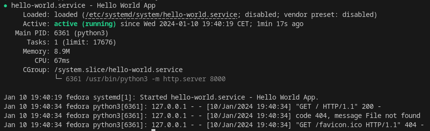

google keyword: Linux service

# How to Create Your App as a Linux Service


In this article I'll walk you through the process of making your application into a Linux service.
For this demonstration, I've chosen a straightforward "hello world" index.html page.

Let me directly go through codes, and all the detailed explanation shall be provided after we complete the scripting.

To start, let's take a look at what the index.html page looks like:


Code:
```html
<!DOCTYPE html>
<html lang="en">
<head>
    <meta charset="UTF-8">
    <meta name="viewport" content="width=device-width, initial-scale=1.0">
    <title>Hello-world</title>
</head>
<body>
    <h1>Hello world</h1>
    <p>How are you?</p>
</body>
</html>
```

Presently, the index.html page needs to be running as some form of service, for example, a web server. For simplicity, I will stick with the awesome Python one-liner command, as shown below:
```bash
$ python3 -m http.server 8000
```

Output:
```
Serving HTTP on 0.0.0.0 port 8000 (http://0.0.0.0:8000/) ...
127.0.0.1 - - [10/Jan/2024 19:26:40] "GET / HTTP/1.1" 200 -
```

Great! The index.html is now being served at http://0.0.0.0:8000/. 

Stop the server by pressing ctrl + c 
```
...
127.0.0.1 - - [10/Jan/2024 19:26:40] "GET / HTTP/1.1" 200 -
^C
```

Time to create the `hello-world.service` inside the `/etc/systemd/system/` directory:
```bash
$ sudo vi /etc/systemd/system/hello-world.service
```

with the following codes:
```
[Unit]
Description=Hello World App
After=network.target

[Service]
ExecStart=/usr/bin/python3 -m http.server 8000
User=amaharjande
WorkingDirectory=//home/amaharjande/hello-world/
Restart=always
RestartSec=10

[Install]
WantedBy=multi-user.target
```

*Replace `User=amaharjande` with your username, and `WorkingDirectory` with your actual `index.html` directory. 

Reload the systemd manager configuration:
```bash
$ sudo systemctl daemon-reload
```

Start the linux service:
```bash
$ sudo systemctl start hello-world.service
```

Confirm the status of the Linux service:
```bash
$ systemctl status hello-world
```



Awesome! Now, when you navigate to http://0.0.0.0:8000, the hello-world.service should be up and running.

Now, let's delve into some explanations. In the scripts mentioned above:

- `/etc/systemd/system/` is a directory stores unit files that extend a service [1]. Hence, we added `hello-world.service` inside this directory.
- `network.target` "indicates that the network management stack is up after it has been reached [2]." 
- `ExecStart` specifies the full path of a command that will run to start a service [3].
- `WorkingDirectory` is the location where your app resides.
- `Restart=always` means tjat the service should be restarted automatically in case it exits, regardless of the exit status.
- `RestartSec=10` 10 seconds delay for restart.
- `[Install]`
- `WantedBy=multi-user.target`
After running systemctl enable, a symlink `/etc/systemd/system/multi-user.target.wants/hello-world.service` linking to the actual unit i.e., `/etc/systemd/system/hello-world.service` will be created. It tells systemd to pull in the unit when starting multi-user.target. The inverse systemctl disable will remove that symlink again [4].


Happy coding!


## References
  
[1] Linode, “What is systemd?,” Linode, Sep. 12, 2018. Accessed: Jan. 10, 2024. [Online]. Available: https://www.linode.com/docs/guides/what-is-systemd/

[2] “NetworkTarget.” https://www.freedesktop.org/wiki/Software/systemd/NetworkTarget/ (accessed Jan. 10, 2024).
  
[3] B. Gökmen, “Passing Multiple Parameters to a systemd Service,” Baeldung on Linux, Oct. 03, 2022. https://www.baeldung.com/linux/systemd-multiple-parameters (accessed Jan. 10, 2024).

[4] “systemd.unit.” https://www.freedesktop.org/software/systemd/man/latest/systemd.unit.html (accessed Jan. 10, 2024).