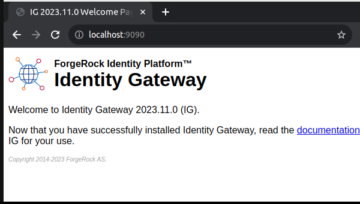
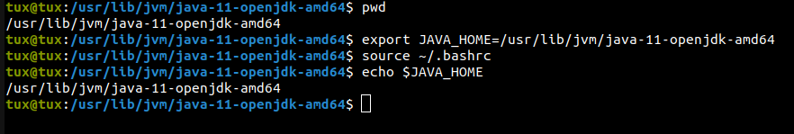
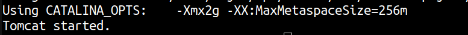
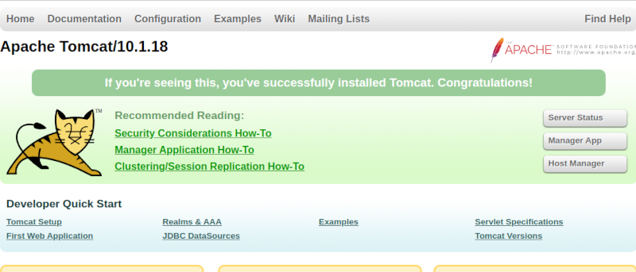
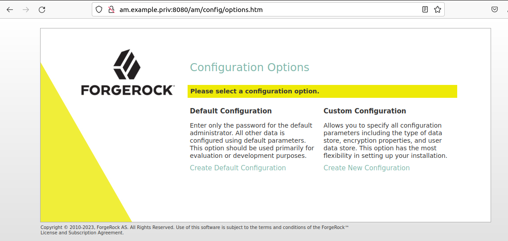
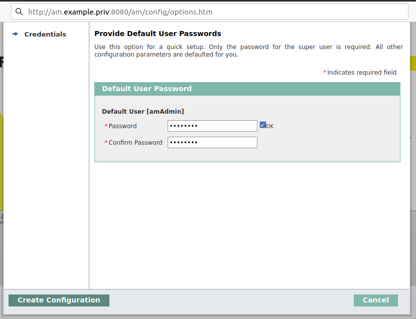
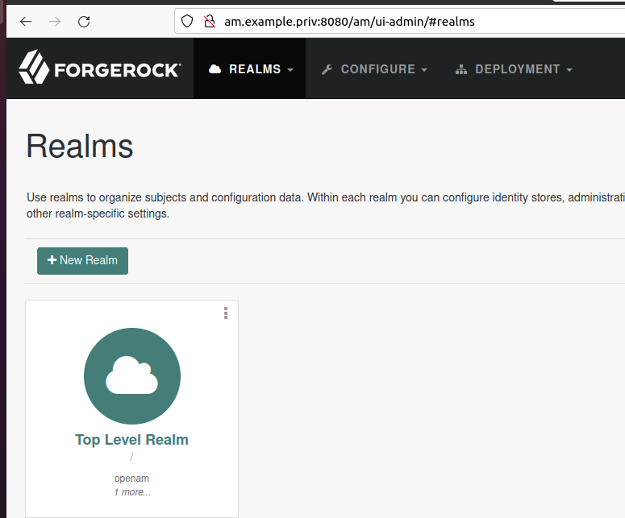
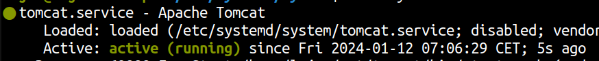
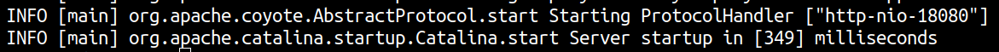

## Getting started on ForgeRock Identity Gateway - Draft

## TOC
- Setting up ForgeRock Identity Gateway
- Setting up Apache Tomcat
- Setting up ForgeRock Access Management
- References

## Prerequisites
- Linux knowledge
- Knowledge on `vi`

## Setting up ForgeRock Identity Gateway


```
$ mkdir ~/opt/forgerock/
```

Download `IG-2023.11.0.zip`

```bash
$ cd ~/opt/forgerock/
$ unzip ~/Downloads/IG-2023.11.0.zip
```

Create `admin.json` as mentioned below:

```bash
$ mkdir ~/.openig && mkdir ~/.openig/config/

$ vi ~/.openig/config/admin.json
```

And paste the following:
```json
{
    "connectors": [
        {
            "port": 19080
        },
        {
            "port": 19081,
            "vertx": {
                "maxWebSocketFrameSize": 128000,
                "maxWebSocketMessageSize": 256000,
                "compressionLevel": 4
            }
        }
    ]
}
```

* IG will start on non-default ports, i.e., 19080 Vert.x-specific connection on port 19081.

### Starting IG
```bash
$ cd ~/opt/forgerock/identity-gateway/bin
$ ./start.sh
```

Output:
```
...
[main] INFO  o.f.openig.launcher.Launcher @system - All 16 verticles started in 1479ms on ports : [19080, 19081]
```

This means, your IG is up and running. Browse http://localhost:19080



### Stopping IG
Let's stop the IG for now by pressing ctrl + c.


### IG as a Linux Service


```
$ sudo vi /etc/systemd/system/identity-gateway.service
```

Paste the following:

```
[Unit]
Description=ForgeRock Identity Gateway
After=network.target

[Service]
User=amaharjande
ExecStart=/home/amaharjande/opt/forgerock/identity-gateway/bin/start.sh
ExecStop=/home/amaharjande/opt/forgerock/identity-gateway/bin/stop.sh

Restart=always
RestartSec=10

[Install]
WantedBy=multi-user.target
```

*change `amaharjande` to your relevant name.

Reload the daemon and start the service:
```
$ sudo systemctl daemon-reload
$ sudo systemctl start identity-gateway
$ sudo systemctl enable identity-gateway
$ systemctl status identity-gateway
```


Now, let's move into the next section. Setting up the ForgeRock Access Management.
ForgeRock AM runs as a web container, one of the ways to run AM is through Apache Tomcat.
Let's go ahead and setup the Apache Tomcat.

## Apache Tomcat

Apache Tomcat is a popular open source web server and servlet container for Java code [1].

## Setting up Tomcat

Make sure that you have JAVA installed on your machine:

```bash
$ java --version

#output
openjdk 11.0.21 2023-10-17
```

If not:
```bash
$ sudo apt install openjdk-11-jre-headless
```

Also, make sure `JAVA_HOME` exists, if not:

```bash
$ export JAVA_HOME=/usr/lib/jvm/java-11-openjdk-amd64
```

```bash
$ source ~/.bashrc
```

Let's verify JAVA_HOME:
```bash
$ echo $JAVA_HOME
```



```bash
$ sudo chmod 644 $JAVA_HOME/lib/security/cacerts
```

Make sure of /etc/hosts:

```
$ sudo vi /etc/hosts

127.0.0.1    am.example.priv    #port 8080 for AM purposes.
```


Download Apache Tomcat from https://tomcat.apache.org/download-10.cgi. I am using `apache-tomcat-8.5.70.zip`. You can find this inside `assets/tomcat/`.
```bash
$ sudo apt update
$ mkdir ~/opt/tomcat
$ uzip apache-tomcat-8.5.70.zip ~/opt/tomcat
```

Here, note `server.xml`, Tomcat uses port `8080`:
```
<Connector port="8080" protocol="HTTP/1.1" 
  connectionTimeout="20000" 
  redirectPort="8443"
  maxParameterCount="1000" />
```

Create `setenv.sh`:
```bash
$ vi ~/opt/tomcat/bin/setenv.sh
```

Paste the following code:
```
export JAVA_HOME=/usr/lib/jvm/java-11-openjdk-amd64
export CATALINA_OPTS="$CATALINA_OPTS -Xmx2g -XX:MaxMetaspaceSize=256m"
```

```bash
$ chmod -R +x ~/opt/tomcat/bin
```

Nice, now let's start the Tomcat:

```bash
$ cd ~/opt/tomcat/bin
$ ./startup.sh
```

Output:



Now, check browse http://am.example.priv:18080, you should be seeing something like below:




## Setting up ForgeRock AM


Download `AM-7.4.0.war` from https://backstage.forgerock.com/downloads/browse/am/featured.

Rename `AM-7.4.0.war` to `am`:

Copy the .war file to `~/opt/tomcat/webapps`:
```bash
$ cp ~/Downloads/am.war  ~/opt/tomcat/webapps
```

*The .war must be inside `webapps` folder!

Now, let us shutdown and restart the Tomcat service:
```bash
$ cd ~/opt/tomcat/bin
$ ./shutdown.sh -force
$ ./startup.sh
```

After few seconds of starting up, 

goto http://am.example.priv:8080/am, you should be able to see installation wizard as below:



Now, in the setup wizard,

- choose `Default configuration`.
- provide `amAdmin` password `passw0rd`.
- click `Create configuration` which make take sometime.



After the successful installation, click on `proceed to login` and provide your above-mentioned credential.




figure. First glimpse of ForgeRock Access Management 7.4.0.

## (Optional) Create Tomcat as a Linux Service

Let's stop the server for now:
```bash
$ ./shutdown.sh
```

```bash
$ sudo vi /etc/systemd/system/tomcat.service
```

Paste the following:

```bash
[Unit]
Description=Apache Tomcat
After=network.target

[Service]
Type=forking
User=amaharjande

Environment="JAVA_HOME=/usr/lib/jvm/java-11-openjdk-amd64"
Environment="JAVA_OPTS=-Djava.security.egd=file:///dev/urandom"
Environment="CATALINA_BASE=/home/amaharjande/opt/tomcat"
Environment="CATALINA_HOME=/home/amaharjande/opt/tomcat"
Environment="CATALINA_PID=/home/amaharjande/opt/tomcat/temp/tomcat.pid"
Environment="CATALINA_OPTS=-Xmx2g -XX:MaxMetaspaceSize=256m"

ExecStart=/home/amaharjande/opt/tomcat/bin/startup.sh
ExecStop=/home/amaharjande/opt/tomcat/bin/shutdown.sh

Restart=always
RestartSec=10

[Install]
WantedBy=multi-user.target
```

*replace `amaharjande` to your `$USER`.

*I've explain "App as a Linux Service" in-depth on this [article](https://amaharjan.de/?p=261).

Reload the daemon:
```bash
$ sudo systemctl daemon-reload
```

```bash
$ sudo systemctl start tomcat
$ sudo systemctl enable tomcat
$ systemctl status tomcat
```

Output:



Also, the http://localhost:18080 should be up and running.

To check the logs of the Tomcat, use the following command:
```bash
$ tail ~/opt/tomcat/logs/catalina.out
```




## References

[1] P. Fol, “Java basics: What is apache tomcat?,” JRebel by Perforce, Mar. 17, 2022. https://www.jrebel.com/blog/what-is-apache-tomcat (accessed Jan. 12, 2024).


[2] https://www.digitalocean.com/community/tutorials/how-to-install-apache-tomcat-10-on-ubuntu-20-04
