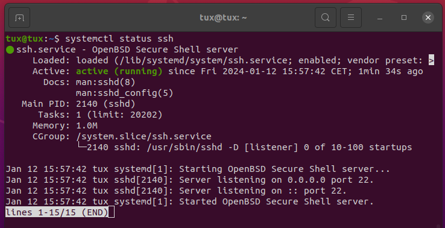

# Linux Crash Course for Absolute Beginners (2024)

## SSH

"The Secure Shell (SSH) Protocol is a protocol for secure remote login and other secure network services over an insecure network [1]"

The SSH uses port number 22.

```
$ sudo apt install openssh-server
```

You should be able see the ssh.service being activated:
```bash
$ systemctl status ssh
```

Screenshot:

## References

  
[1] T. Ylonen and C. Lonvick, “RFC 4251: The Secure Shell (SSH) Protocol Architecture.” https://www.rfc-editor.org/rfc/rfc4251 (accessed Jan. 12, 2024).
  

