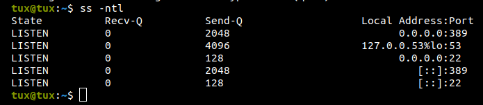
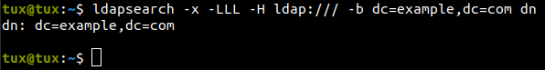

# OpenLDAP Tutorial Series

## What is LDAP? And why is it important?
todo

**Prerequisites:**
- Proficiency in Linux
- An Ubuntu server set up and running on Oracle VirtualBox
- Basic networking knowledge

## Initial setup
Begin by setting up a VirtualBox instance running Ubuntu Server 22.04.3. Download the server from https://ubuntu.com/download/server.

After downloading the server, proceed to configure the VirtualBox environment.

Take note of the IP address assigned to the Ubuntu server and we shall call it `myldapserver`

```bash
$ ip addr

192.168.0.79
```

Now, on your "main" machine, let us do couple of things. Firstly, update `/etc/hosts`:
```bash
$ sudo vi /etc/hosts

192.168.0.79    myldapserver
```

Secondly, copy `id_rsa.pub` to the `myldapserver`:
```bash
$ ssh-copy-id -i ~/.ssh/id_rsa.pub tux@myldapserver
```

*Replace tux with your myldapserver's actual username.

And attempt to log into the machine using the following command:
```bash
$ ssh username@myldapserver
```

## Moving on to myldapserver
Also, update `/etc/hosts` on the `myldapserver`:
```bash
$ sudo vi /etc/hosts

127.0.0.1    localhost
192.168.0.79 myldapserver.example.com myldapserver
```

### Install (1) ldap-utils and (2) slapd
```bash
$ sudo apt install -y ldap-utils
$ sudo apt install -y slapd
```

Give an administrator password:
```
Administrator password: passw0rd
```

Now, investigate the sockets on myldapserver. You can observe that port `389` is up and running. LDAP uses tcp 389 for its service [2].

```bash
$ ss -nlt
```



Check if the installation works:
```bash
$ ldapsearch -x -LLL -H ldap:/// -b dc=example,dc=com  dn

No such object (32)
```

Don't worry if there is a "no such object" error; I will explain what those commands were. For now, in the next section, let's proceed to reconfigure the LDAP server.

## Reconfiguring slapd

```bash
$ sudo dpkg-reconfigure slapd
```

```
Omit OpenLDAP server configuration? No
DNS domain name: example.com
Organization name: example.com
Administrator password: passw0rd
Do you want the database to be removed when slapd is purged? No
Move old database? Yes
```

*In a Debian-based distribution, dpkg-reconfigure is used to reconfigure packages after they have already been installed [1].

Now, please try the following steps again:
```bash
$ ldapsearch -x -LLL -H ldap:/// -b dc=example,dc=com dn
```

You must see the following output:



Awesome, let me break down the aforementioned command for you. First of all we are initiating a search request to the LDAP directory from the base DN.
- `-x` indicates the use of simple authentication.
- `-LLL` indicates the output result should be in LDIF format without any comments.
- `-H ldap:///:` specifies the URI of the LDAP server.
- `-b dc=example,dc=com` specifies base DN for the search.
- `dn` is the attribute we want to see in the result.

#### Create Upper Layers
Now, let's create an upper layer called `structure.ldif`:

```bash
$ vi structure.ldif
```

```bash
dn: ou=people,dc=example,dc=com
objectClass: organizationalUnit
ou: people

dn: ou=groups,dc=example,dc=com
objectClass: organizationalUnit
ou: groups
```
Above, we defined two organizational units (OU) called `people` and `groups`.

```bash
$ ldapadd -w passw0rd -D cn=admin,dc=example,dc=com -f structure.ldif
```
And this command adds the entries from `structure.ldif` to the LDAP directory.
- `-W` prompts for bind password.
- `-D` binds DN
- `-f` represents file (read operations from the file)

Once again do the `ldapsearch`:
```bash
$ ldapsearch -x -LLL -H ldap:/// -b dc=example,dc=com
```

The output should be something like:
```
dn: dc=example,dc=com
objectClass: top
objectClass: dcObject
objectClass: organization
o: example.com
dc: example

dn: ou=people,dc=example,dc=com
objectClass: organizationalUnit
ou: people

dn: ou=groups,dc=example,dc=com
objectClass: organizationalUnit
ou: groups
```

Moreover, try to connect `myldapserver` outside from your virtual box, i.e., "main" machine and should get the same successful results.
```bash
main-machine:~$ ldapsearch -x -LLL -H ldap://myldapserver:389 -b dc=example,dc=com
```

Now, moving on the next section.

## References
[1] https://manpages.ubuntu.com/manpages/jammy/en/man8/dpkg-reconfigure.8.html
[2] https://www.speedguide.net/port.php?port=389