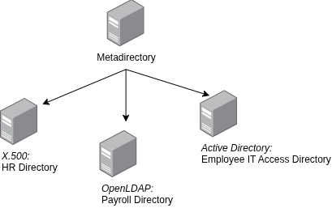

# Introduction

Crash course on Active Directory

## TOC

Chapter 1: What is Active Directory (AD)?

## 1. What is Active Directory (AD)?
AD is a directory service developed by [Microsoft](http://microsoft.com/)

**But what is directory service anyway?**

- A directory service is kind of centralized database
- For storing, organizing, and maintaining **information** about users, computers, groups, resources, etc

**Common examples of directory services includes:**
- [X.500](https://en.wikipedia.org/wiki/X.500)
- LDAP-based directories (e.g., [OpenLDAP]())
- Microsoft's Active Directory

**Furthermore:**
- AD manages enterprises-wide data (users, computers, groups, printers) from a central repository
- Data in AD can be globally distributed and accessed selectively as needed
- AD implements LDAP v3 and fully supports LDAP-based queries and authentication

**Articles recommended by the author**
- [Active Directory Installation Guide](https://amaharjan.de/active-directory-tutorial/)
- [Getting started with LDAP](https://amaharjan.de/getting-started-with-ldap/)

**References**
- https://amaharjan.de/getting-started-with-ldap/

## Metadirectories

Metadirectories aggregate identity data from multiple, diverse directories into **one unified view** without replacing existing systems.

## Key benefits
- Metadirectories provides a single point of reference
- It allows organizations to search and query identity data like it is a single directory
- It reduces complexity of managing multiple directories interfaces
- It also eliminates duplicate identity data across systems

## Reference
- [Wind05]  P. J. Windley, Digital Identity. O’Reilly Media, 2005. [Online]. Available: https://books.google.de/books?id=WTmbAgAAQBAJ

