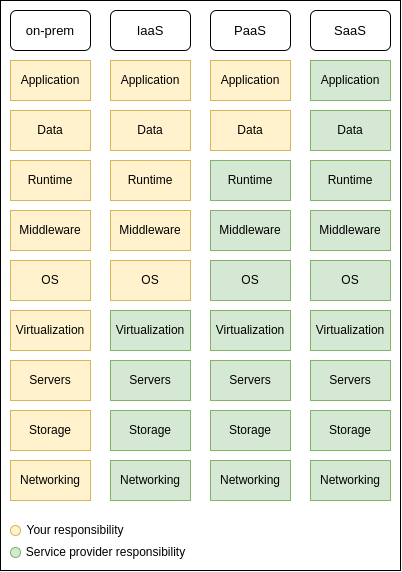
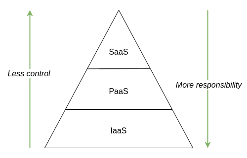

# Cloud concepts

## What is cloud computing?

In the simplest terms, cloud computing is the delivery of various services through the internet. This includes data storage, networking, servers, different software, databases, etc. [1] without direct active management by the user [2].

## What is IaaS, PaaS, and SaaS?
According to NIST, cloud computing comprises three primary service models. Let's delve into each one:

### 1. Infrastructure as a service (IaaS)

In this cloud computing service model, computing resources are provided by a cloud service vendor [3]. So, when you create an IaaS resource, the cloud service provider allocates a Virtual Machine (VM) for you [4]. Furthermore, the IaaS provides  access to shared resources on need basis without revealing details like location and hardware to clients; offers server images on demand, storage, queuing, other resources information; and gives full control of server infrastructure [5].

Some of the example for IaaS includes Amazon Web Services (AWS), Microsoft Azure, Google Compute Engine (GCE), IBM Cloud, Rackspace, Digital Ocean, Oracle Cloud. Additionally, as you can see on the figure 1, the providers manage networking, storage, servers, virtualization, while you are responsible for managing OS, middleware, runtime, data, and application.

### 2. Platform as a service (PaaS)
PaaS is a comprehensive cloud environment that encompasses everything developers need to build, run, and manage their applications [15]. When you acquire resources through a cloud service provider (usually on a pay-as-you-go basis and accessed via a secure internet connection) [14], the PaaS infrastructure provides servers, operating systems, as well as all the necessary networking, storage, middleware, database management systems (DBMS), tools, and so on [15].

Some of the leading market players in the PaaS domain include SAP Cloud, Microsoft Azure, Heroku, AWS Lambda, Google App Engine, and others. Each of these examples has its unique selling points and a roadmap for rapid application development [6].

In the PaaS model, you are only responsible for the Application and Data, while the cloud provider manages runtime, middleware, OS, virtualization, servers, storage, and networking [see figure 1].

### 3. Software as a Service (SaaS)
Saas is a software distribution model where applications are hosted by a cloud service provider and made available to customers over a secure network [5]. In addition, the provider licenses a software application to be used and purchased on demand [7]. Consequently, the cloud provider is responsible for managing everything from application to networking (see figure 1). SaaS services offer the flexibility of a pay-as-you-go model, allowing customers to benefit from new features and up-to-date software [4]. Examples of SaaS include Slack, GitHub, Microsoft 365, Dropbox, Google Suite, and SAP Concur.

<i>figure 1. Iaas, PaaS, and SaaS (based on [12])</i>

<b>Note:</b> Compliance in the cloud can pose an additional set of challenges for an organization. As illustrated in figure 2, different models provide varying levels of control and responsibility.

<i>figure 2. Cloud models; their control and responsibility (based on [13])</i>

## Deployment Models of Cloud
Commonly found models of the cloud include 1. Private, 2. Public, and 3. Hybrid. Now, let’s discuss these cloud models:

### 1. Private Cloud
Private cloud is often referred to as Internal cloud or on-premises cloud [7], and it is hosted in an on-premises environment or by a third-party hosting provider [4] where all cloud resources are dedicated to a single customer or firm [11]. Moreover, it is considered one of the most secure models, as data processes are usually controlled and managed by a single entity [8].

### 2. Public Cloud
The common deployment model is the public cloud, where a customer share infrastructure that is accessible on a public network. Microsoft Azure is a good example of a Public cloud [4]. Often referred to as a multi-tenant environment, customers can benefit from a “pay-as-you-go” model; in which a firm only pays for services and resources they have used [8].

### 3. Hybrid Cloud
A combination of public clouds, on-premises computing, and private cloud is known as a Hybrid cloud. The main benefit of this model is agility [9]; with a hybrid cloud, a firm has the opportunity to obtain “the best of both worlds,” i.e., private and public cloud [10].

## References

- [1] J. Frankenfield. "What is Cloud Computing? Pros and Cons of Different Types of Services". Investopedia.com. https://www.investopedia.com/terms/c/cloud-computing.asp (accessed Dec. 17, 2023).
- [2] "Cloud computing". Wikipedia.org. https://en.wikipedia.org/wiki/Cloud_computing (accessed on Dec. 17, 2023).
- [3] "Infrastructure as a service". Wikipedia.org. https://en.wikipedia.org/wiki/Infrastructure_as_a_service (accessed on Nov. 27, 2023).
- [4] J. Cheshire, <i>Exam Ref AZ-900 Microsoft Azure Fundamentals</i>. Pearson Education, 2019.
- [5] S. S. Manvi and G. Krishna Shyam, “Resource management for Infrastructure as a Service (IaaS) in cloud computing: A survey,” Journal of Network and Computer Applications, vol. 41, pp. 424–440, May 2014, doi: 10.1016/j.jnca.2013.10.004.
- [6] Un. E. Team, “15 Important PaaS Examples in Cloud Computing,” UNext Learning, Nov. 17, 2022. https://u-next.com/blogs/cloud-computing/paas-examples/ (accessed Dec. 1, 2023).
- [7] D. Rani and R. Ranjan, “A Comparative Study of SaaS, PaaS and IaaS in Cloud Computing,” 2014. [Online]. Available: https://scholar.google.com/scholar?cluster=556619027124483768&#38;hl=en&#38;as_sdt=2005&#38;sciodt=0,5
- [8] T. Diaby and B. B. Rad, “Cloud Computing: A review of the Concepts and Deployment Models,” International Journal of Information Technology and Computer Science, vol. 9, no. 6, pp. 50–58, Jun. 2017, doi: 10.5815/ijitcs.2017.06.07.
- [9] “What is Hybrid Cloud? Definition and Benefits,” 9. https://www.9.com/hybrid-cloud/what-is-hybrid-cloud/ (accessed Dec. 17, 2023).
- [10] “What is a hybrid cloud and how does it work?,” Fortinet. https://www.fortinet.com/resources/cyberglossary/what-is-hybrid-cloud (accessed Dec. 17, 2023).
- [11] “What is private cloud ,” Google Cloud. https://cloud.google.com/discover/what-is-a-private-cloud (accessed Dec. 17, 2023).
- [12] https://www.redhat.com/rhdc/managed-files/iaas-paas-saas-diagram5.1-1638x1046.png (accessed Dec. 18, 2023).
- [13] J. Andress, Foundations of Information Security: A Straightforward Introduction. No Starch Press, 2019, pp. 147–148.
- [14] “What is PaaS? Platform as a Service,” Microsoft Azure. https://azure.microsoft.com/en-us/resources/cloud-computing-dictionary/what-is-paas (accessed Dec. 1, 2023).  
- [15] “What Is PaaS? ,” Google Cloud. https://cloud.google.com/learn/what-is-paas (accessed Dec. 1, 2023).
