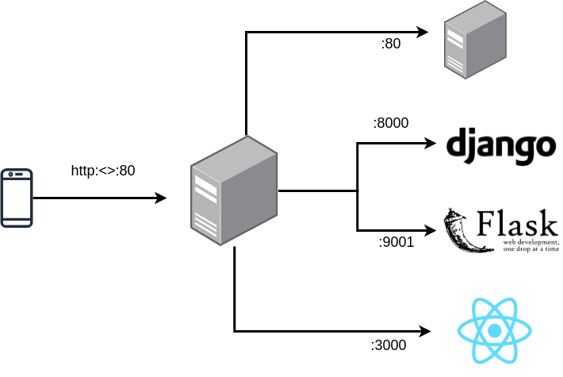

# Reverse proxy
A reverse proxy server is a type of proxy server that typically sits behind the firewall in a private network and directs client requests to the appropriate backend server.

A reverse proxy ultimately forwards user/web browser requests to web servers [1](https://www.nginx.com/resources/glossary/reverse-proxy-server/#:~:text=A%20reverse%20proxy%20server%20is,traffic%20between%20clients%20and%20servers.).


<!--  -->

## Setting up flask server
Setting up:
```
$ mkdir helloworld-proj
$ cd helloworld-proj
$ pipenv install flask
```
Structure the project folder:
```
$ vim app.py
```
```python
from flask import Flask

app = Flask(__name__)

@app.route("/")
def hello_world():
    return "<p>Hello, World!</p>"
```

```
$ pipenv shell
```

```
# for python 3
$ pipenv shell --python 3
```

```
$ python -m flask run
```
```
...
* Debug mode: off
* Running on http://127.0.0.1:5000/
...
```

Update /etc/hosts
```
$ sudo vim /etc/hosts
```
```
...
127.0.0.1   helloworld.priv
```

Update /etc/apache2/sites-available/000-default.conf
```
...
<VirtualHost *:80>
    ServerName helloworld.priv
    ProxyPass / http://127.0.0.1:5000/
    ProxyPassReverse / http://127.0.0.1:5000/
</VirtualHost>
```
```
$ sudo a2enmod proxy
$ sudo a2enmod proxy_http
$ sudo systemctl restart apache2
```

Now, try to access http://helloworld.priv

Additionally, if you want to proxy reverse via `URL path`:
```
<VirtualHost *:80>
    ProxyPreservehost On

    #ServerName localhost
    #ServerName hello-world.duckdns.org

    ProxyPass /web1 http://127.0.0.1:5000/
    ProxyPassReverse /web1 http://127.0.0.1:5000/
</VirtualHost>
```
Try accessing http://localhost/web1 OR http://hello-world.duckdns.org it will proxy reverse to http://127.0.0.1:5000/

# References
[`[1] https://www.digitalocean.com/...proxy-on-ubuntu-16-04`](https://www.digitalocean.com/community/tutorials/how-to-use-apache-as-a-reverse-proxy-with-mod_proxy-on-ubuntu-16-04)
