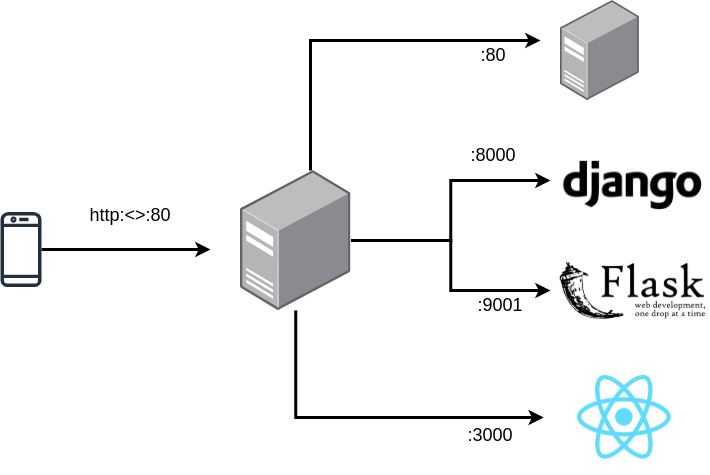

# Reverse proxy
A reverse proxy server is a type of proxy server that typically sits behind the firewall in a private network and directs client requests to the appropriate backend server.

A reverse proxy ultimately forwards user/web browser requests to web servers [1](https://www.nginx.com/resources/glossary/reverse-proxy-server/#:~:text=A%20reverse%20proxy%20server%20is,traffic%20between%20clients%20and%20servers.).


<!--  -->

# 1. Setting up apache2 server
```
$ sudo apt update
```
```
$ sudo apt upgrade -y
```
```
$ sudo apt install apache2
```
```
$ sudo systemctl start apache2
```
Now, if you browse http://localhost, it should be working. By default it redirect you to default apache2 page. Let's edit that!

Goto `/var/www/html` and edit `index.html`
```
<html>
    <head>
        <title>hello world</title>
    </head>
    <body>
        <h1>Hello World</h1>
    </body>
</html>
```
Now, refresh `http://localhost/`

# 2. Up and running Django [optional]
It's time to create a Django website. This is optional, you can working with your existing web project (but remember the port that your project usage).

```
$ mkdir django-proj && cd django-proj
```

Working with venv (Python 3 virtual environment):
```
$ python3 -m venv env
```

Activating a virtual environment (env)
```
$ source env/bin/activate 
```

Installing `Django 4.0.3` and starting app `django_project_2022`
```
(env) $ pip3 install django
(env) $ django-admin startproject django_project_2022
(env) $ cd django_project_2022
```

The following command shall run the  `django_project_2022` project in port `8000`. Make sure it stays open.
```
(env) .. django_project_2022$ python3 manage.py runserver
```

```
output:

Django version 4.0.3, using settings 'django_project_2022.settings'
Starting development server at http://127.0.0.1:8000/
Quit the server with CONTROL-C.
```

Awesome! now let's move to next step.

# 2. Setting up flask server
In this step you will start a flask project. First, let's setup:

```
$ mkdir flask-proj && cd flask-proj
```

Working with venv
```
$ python3 -m venv env
$ source env/bin/activate
```

Installing flask
```
(env) flask-proj$ pip3 install `flask 2.1.1`
```

Structure the project folder (i.e. add `app.py`):
```
(env) flask-proj$ vi app.py
```
```python
from flask import Flask

app = Flask(__name__)

@app.route("/")
def hello_world():
    return "<p>Hello, World!</p>"
```

Now, when you run the following command, it will start your flask project on port 9001
```
$ python3 -m flask run -p 9001
```

```
output:
* Debug mode: off
* Running on http://127.0.0.1:9001/
...
```

# 3. Up and running ReactJs [optional]

# 4. Update /etc/hosts
```
$ sudo vi /etc/hosts
```
```
...
127.0.0.1   helloworld-django.priv
127.0.0.1   helloworld-flask.priv
```

## 4.2. Update 000-default.conf

```
$ sudo vi /etc/apache2/sites-available/000-default.conf
```

```
# django project
<VirtualHost *:80>
    ServerName helloworld-django.priv
    ProxyPass / http://127.0.0.1:8000/
    ProxyPassReverse / http://127.0.0.1:8000/
</VirtualHost>

# flask project
<VirtualHost *:80>
    ServerName helloworld-flask.priv
    ProxyPass / http://127.0.0.1:9001/
    ProxyPassReverse / http://127.0.0.1:9001/
</VirtualHost>
```

```
$ sudo a2enmod proxy
$ sudo a2enmod proxy_http
$ sudo systemctl restart apache2
```

Now, try to access helloworld-django.priv. This should work, it should redirect you to your running Django project (port 8000).

And when you try to access hthelloworld-flask.priv. This should work, it should redirect you to your running Flask project (port 9001).

# 5. Additionally!

1. You can also use free DNS services like  `duckdns.org`. You just have to update your `ServerName`. So, that it is accessible from anywhere.

2. What if you want to you `URL path`

    - For an example: http://localhost/django that redirects to existing Django project
    - For an example: http://localhost/flask that redirects to existing Flask project

This will how you will solve it:

```
$ sudo vi /etc/apache2/sites-available/000-default.conf
```

```
<VirtualHost *:80>
    ProxyPreservehost On
    ServerName localhost
    #ServerName hello-world.duckdns.org

    ProxyPass /django http://127.0.0.1:8000/
    ProxyPass /flask http://127.0.0.1:9001/
</VirtualHost>
```

Finally, try accessing http://localhost/django OR http://localhost/flask it will proxy reverse to http://127.0.0.1:8000/ OR http://127.0.0.1:9001/ respectively.

# References
[`[1] https://www.digitalocean.com/...proxy-on-ubuntu-16-04`](https://www.digitalocean.com/community/tutorials/how-to-use-apache-as-a-reverse-proxy-with-mod_proxy-on-ubuntu-16-04)
