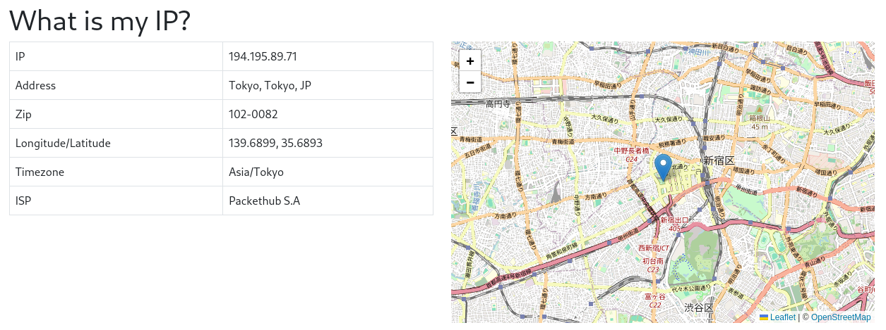

# What is my IP? - A simple Flask project.

In this article I am going to show you how you can create your own public IP address viewer using Flask.
A public IP address is an IP address that can be acquired directly over the internet and is assigned to your network router by your internet service provider (ISP) [1].

## Tech Stack
- HTML, Bootstrap 5, JavaScript
- Flask, Python

## Level
- Beginner

## venv setup

```bash
$ mkdir whatismyip
$ python -m venv venv
$ source venv/bin/activate
```

## Install requirements.txt
```bash
$ vi requirements.txt

blinker==1.7.0
certifi==2023.11.17
charset-normalizer==3.3.2
click==8.1.7
Flask==3.0.0
idna==3.6
itsdangerous==2.1.2
Jinja2==3.1.2
MarkupSafe==2.1.3
requests==2.31.0
urllib3==2.1.0
Werkzeug==3.0.1
```

```bash
$ pip install -r requirements.txt
```

## Create index.html
```bash
$ mkdir templates
$ vi templates/index.html
```

```html
<!doctype html>
<html lang="en">

<head>
    <meta charset="utf-8">
    <meta name="viewport" content="width=device-width, initial-scale=1">

    <!-- Bootstrap CSS -->
    <link href="https://cdn.jsdelivr.net/npm/bootstrap@5.0.2/dist/css/bootstrap.min.css" rel="stylesheet"
        integrity="sha384-EVSTQN3/azprG1Anm3QDgpJLIm9Nao0Yz1ztcQTwFspd3yD65VohhpuuCOmLASjC" crossorigin="anonymous">

    <!-- leaflet -->
    <link rel="stylesheet" href="https://unpkg.com/leaflet@1.9.4/dist/leaflet.css"
        integrity="sha256-p4NxAoJBhIIN+hmNHrzRCf9tD/miZyoHS5obTRR9BMY=" crossorigin="" />
    <!-- Make sure you put this AFTER Leaflet's CSS -->
    <script src="https://unpkg.com/leaflet@1.9.4/dist/leaflet.js"
        integrity="sha256-20nQCchB9co0qIjJZRGuk2/Z9VM+kNiyxNV1lvTlZBo=" crossorigin=""></script>

    <style>
        html,
        body {
            height: 100%;
            margin: 0;
            padding: 0;
        }

        #map {
            height: 100%;
        }
    </style>

    <title>Whatismyip?</title>
</head>

<body>
    <div class="row pt-4">
        <div class="offset-md-2 col-md-4">
            <h1>What is my IP?</h1>
        </div>
    </div>
    <div class="row">
        <!-- column 1 -->
        <div class="offset-md-2 col-md-4">
            <!-- table -->
            <table class="table table-bordered table-responsive">
                <tbody>
                    <tr>
                        <td>IP</td>
                        <td>{{ data.query }}</td>
                    </tr>
                    <tr>
                        <td>Address</td>
                        <td>{{ data.city }}, {{ data.regionName}}, {{ data.countryCode }}</td>
                    </tr>
                    <tr>
                        <td>Zip</td>
                        <td>{{ data.zip }}</td>
                    </tr>
                    <tr>
                        <td>Longitude/Latitude</td>
                        <td>{{ data.lon }}, {{ data.lat }}</td>
                    </tr>
                    <tr>
                        <td>Timezone</td>
                        <td>{{ data.timezone }}</td>
                    </tr>
                    <tr>
                        <td>ISP</td>
                        <td>{{ data.org }}</td>
                    </tr>

                </tbody>
            </table>
        </div>
        <!-- column 2 -->
        <div class="col-md-4 d-flex justify-content-center align-items-center">
            <div id="map" style="width: 600px; height: 400px;"></div>
        </div>
    </div>

    <!-- script for #map -->
    <script>
        var latLon = ['{{data.lat}}', '{{data.lon}}']
        const map = L.map('map').setView(latLon, 13);

        const tiles = L.tileLayer('https://tile.openstreetmap.org/{z}/{x}/{y}.png', {
            maxZoom: 19,
            attribution: '&copy; <a href="http://www.openstreetmap.org/copyright">OpenStreetMap</a>'
        }).addTo(map);

        const marker = L.marker(latLon).addTo(map);
    </script>
</body>
</html>
```

## Now, create app.py
```bash
$ vi app.py
```

```python
__author__ = 'amaharjan.de'

from flask import Flask, render_template

import requests
import json

app = Flask(__name__)

@app.route('/')
def get_ip_info():
    '''
    Retrieves your public IP related information.
    '''
    url = 'http://ip-api.com/json'
    response = requests.get(url)
    return render_template('index.html', data=response.json())

if __name__ == '__main__':
    app.run(debug=True)
```

## Finally, run the app.py

```bash
(venv) $ flask run --port 8080
```

## Screenshot


## References
- [1] https://www.avast.com/c-ip-address-public-vs-private
- [2] http://ip-api.com/json 


